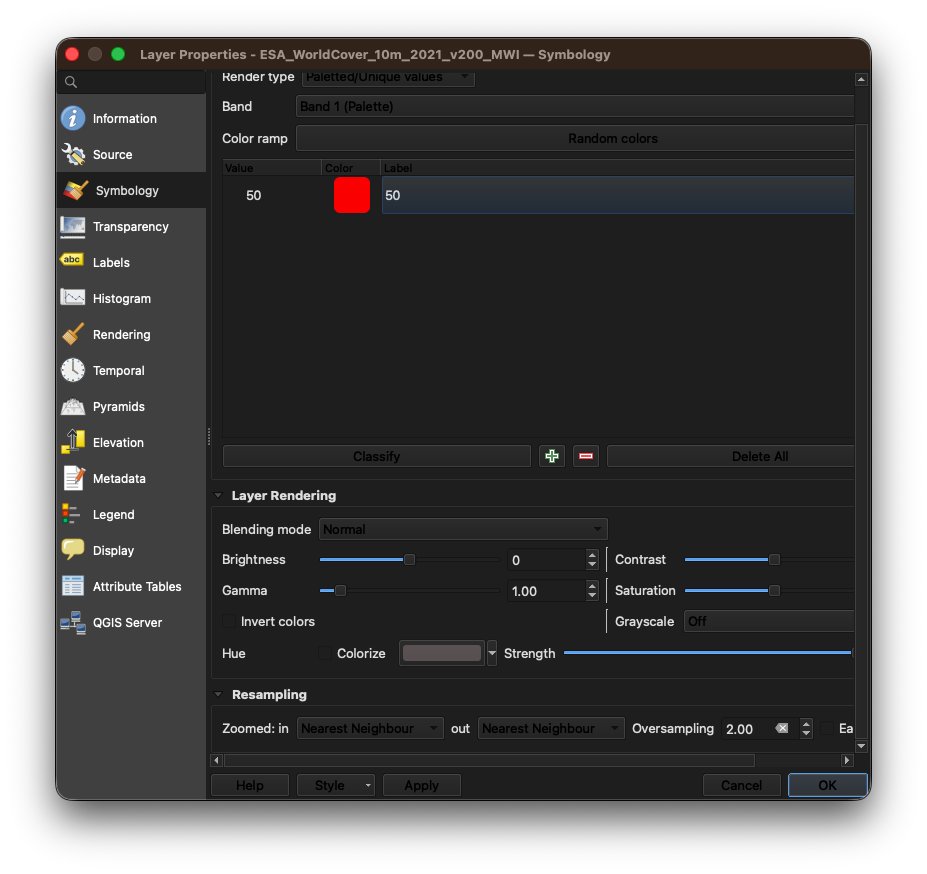
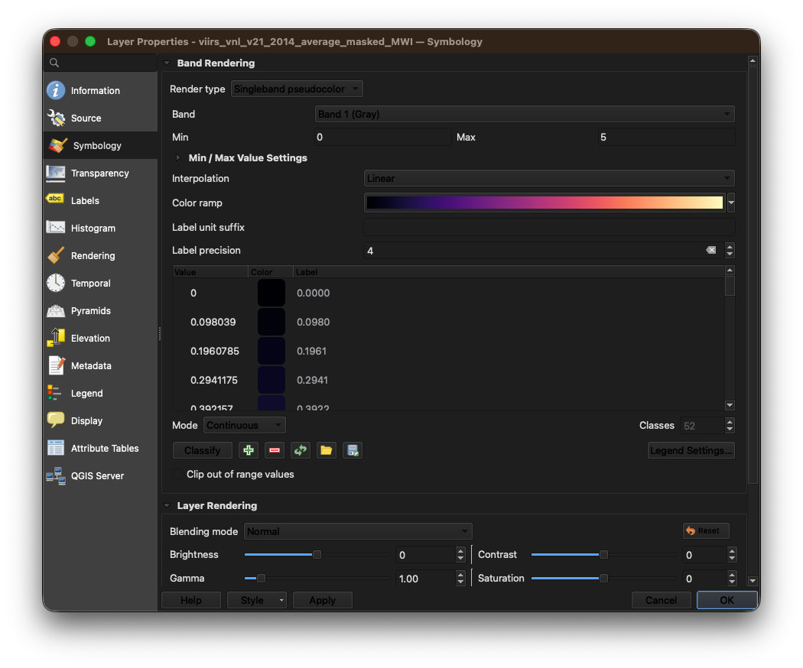
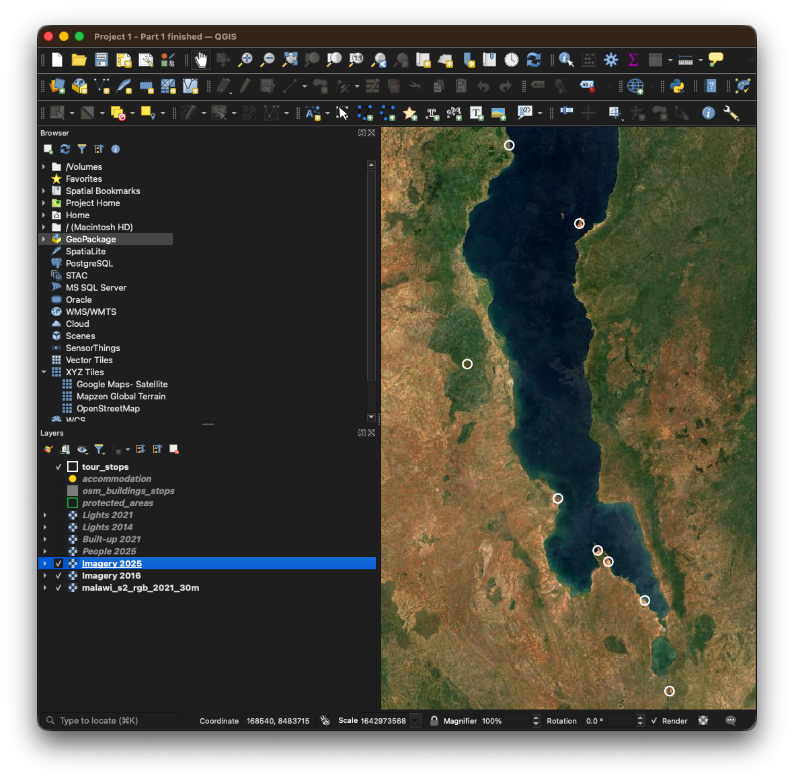
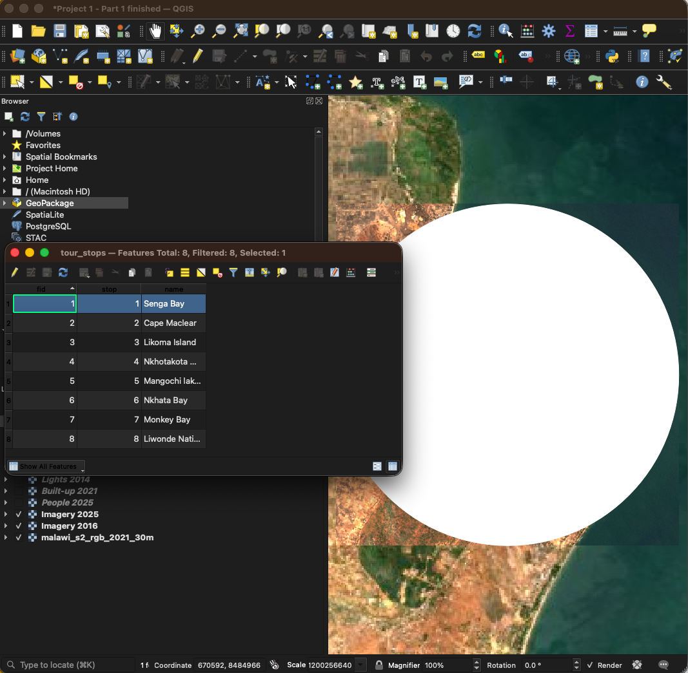

---
output:
  pdf_document:
    latex_engine: xelatex
mainfont: Lucida Grande
monofont: Menlo
monofontoptions:
  - HyphenChar=None
header-includes:
  - \AtBeginDocument{\raggedright}
fontsize: 11pt
geometry: margin=2cm
# Knit writes the PDF straight into training_2026/handouts/
knit: (function(input, ...) rmarkdown::render(input, output_dir = normalizePath(file.path(dirname(input), "..", "..", "handouts"))))
---

# Project 1 — Tourism: what can a satellite see?

**What you'll make:** a filled-in comparison table for eight tourism places in Malawi, and one map of the place that surprised you most.

**The question:** Tourism can't be seen from space. Lodges, roads, buildings and lights *can*. *When do those things tell us about tourism, and when do they mislead us?*

**How:** you load a set of layers once. Then you visit each place and switch the layers on and off one at a time, in the same order every time, writing down what you see. No calculations are needed.

Written for **QGIS 3.44**.

---

## What's in the folder

Open the folder `day3_projects/project1_tourism` on your flash drive. Copy it to your laptop first (for example to your Desktop) and work from the copy.

| File | What it is |
|---|---|
| `malawi_s2_rgb_2021_30m.tif` | Color picture of all of Malawi, 2021. Pixels are 30 × 30 m. The background. |
| `Sentinel2_2016.tif` | Sharper color pictures of the eight places, **August 2016**. Pixels are 10 × 10 m. |
| `Sentinel2_2025.tif` | The same eight places, **September 2025** |
| `ESA_WorldCover_10m_2021_v200_MWI.tif` | Land cover, 2021: trees, crops, water, **built-up**… Pixels are 10 × 10 m. |
| `viirs_vnl_v21_2014_average_masked_MWI.tif` | Night lights, average for **2014**. Pixels are about 460 × 460 m. |
| `viirs_vnl_v21_2021_average_masked_MWI.tif` | Night lights, average for **2021** |
| `mwi_pop_2025_CN_100m_R2025A_v1.tif` | Estimated number of people in each 100 × 100 m square, 2025 (WorldPop) |
| `protected_areas.shp` | National parks and wildlife reserves (OpenStreetMap) |
| `osm_buildings_stops.gpkg` | Building outlines drawn by volunteers (OpenStreetMap), around the eight places only |
| `accommodation.gpkg` | Hotels, lodges, guesthouses, hostels and campsites (OpenStreetMap), all of Malawi |
| `tour_stops.gpkg` | The eight places, each a circle 6 km across |
| `scorecard.docx` | The comparison table you'll fill in (a printed copy is on your table) |
| `lights_by_year_snippet.py` | A ready-made script for Extension B. You don't have to write it or read it |

There are also three folders:

| Folder | What it is |
|---|---|
| `nightlights_all_years/` | One night lights file per year, 2012 to 2022. Only needed for Extension B |
| `checkpoints/` | Saved QGIS projects to fall back on if you get stuck. `project1_start.qgz` has Part 1 done for you |
| `outputs/` | Empty. Everything you make goes in here |

---

## Part 1 — Load the layers

You'll do this once. It takes a while, but after this, the rest of the project is just switching layers on and off.

> **Fallen behind?** Open `project1_start.qgz` from the `checkpoints` folder. It has Part 1
> done for you.

**1.1 Open QGIS** and start a new, empty project: **Project ▸ New**.

**1.2 Load the three color pictures.** **Layer ▸ Add Layer ▸ Add Raster Layer…**, click **…** next to *Raster dataset(s)*. Hold **Ctrl** and click `malawi_s2_rgb_2021_30m.tif`, `Sentinel2_2016.tif` and `Sentinel2_2025.tif`, then **Open**, **Add**, **Close**.

**You should now see** all of Malawi in color, and three layers in the **Layers** panel.

**1.3 Check the coordinate system.** Look at the bottom-right corner of the QGIS window.

**You should now see** `EPSG:32736`. All files in this project use it.

**1.4 Put the pictures in order.** In the Layers panel, drag the layers so that from **top to bottom** they read: `Sentinel2_2025`, `Sentinel2_2016`, `malawi_s2_rgb_2021_30m`. Rename the top two to make them easier to spot: right-click ▸ **Rename Layer**, and call them `Imagery 2025` and `Imagery 2016`.

**Checkpoint.** Save your project in `outputs` as `project1_checkpoint_1.qgz`. If the pictures won't load or won't sit in the right order, open `project1_checkpoint_1.qgz` from the `checkpoints` folder and carry on from there.

**1.5 Load land cover, and show only the built-up areas.** Load `ESA_WorldCover_10m_2021_v200_MWI.tif` the same way as in 1.2. Place it under Imagery 2016 and 2025 in the layer order.

**You should now see** Malawi covered in colors: green for trees, yellow for crops, blue for water, red for built-up. It may take a few seconds to draw.

Right-click it ▸ **Properties…** ▸ **Symbology**. It is already set to **Paletted/Unique values**. We only want built-up (value **50**):

- Click the **first** row, then hold **Shift** and click the **last** row. All rows are selected.
- Hold **Ctrl** and click the row with value **50**. It is no longer selected.
- Click the red **minus** button. Only row 50 is left.
- Alternatively, click the first row then shift click on value 49. Then click the minus. Then do the same for 51-end.
- Double-click its color box and choose a strong **red**. Click **OK**.



**You should now see** only small red patches: towns, trading centers and villages, with a few squares of imagery scattered around if you have Imagery 2025 and/or Imagery 2016 ticked.. Rename the layer `Built-up 2021`.

**1.6 Load the two night lights layers.** Load `viirs_vnl_v21_2014_average_masked_MWI.tif` and `viirs_vnl_v21_2021_average_masked_MWI.tif`.

**You should now see** a dark rectangle covering the whole map, with light spots at the towns and cities.

Now we make them readable. Right-click the **2014** layer ▸ **Properties…** ▸ **Symbology**:

- **Render type:** Singleband pseudocolor
- **Min:** `0` **Max:** `5` (type these in; don't let QGIS choose)
- **Color ramp:** click the arrow and choose **Magma**
- Click **Apply**.

Then go to **Transparency** (left side). In **Additional no data value**, type `0`. Click **OK**.



**You should now see** the dark rectangle gone, and glowing spots over the towns: bright yellow in Lilongwe and Blantyre, dim purple in small towns.

**Give 2021 exactly the same style.** Right-click the 2014 layer ▸ **Styles ▸ Copy Style**. Right-click the 2021 layer ▸ **Styles ▸ Paste Style** (choose **All Style Categories** if asked).

> **Why the same Min and Max?** If QGIS picks the colors for each year separately, the same
> brightness can be yellow in one year and purple in the next. Then flipping between years shows
> you a change that isn't there. **To compare two layers, they must use the same scale.**

Rename them `Lights 2014` and `Lights 2021`.

**1.7 Load population.** Load `mwi_pop_2025_CN_100m_R2025A_v1.tif`. Right-click ▸ **Properties…** ▸ **Symbology** ▸ **Singleband pseudocolor**, **Min** `0`, **Max** `50`, color ramp **Blues**. **Transparency** ▸ **Additional no data value** `0`. **OK**. Rename it `People 2025`.

**You should now see** blue speckles everywhere people live, darkest in the cities.

**Checkpoint.** Save your project as `project1_checkpoint_2.qgz` in `outputs`. If your land cover, lights or population don't look like the descriptions above, open `project1_checkpoint_2.qgz` from the `checkpoints` folder. It has all four rasters styled for you.

**1.8 Load the four vector layers.** **Layer ▸ Add Layer ▸ Add Vector Layer…**, click **…**, hold **Ctrl** and choose `protected_areas.shp`, `osm_buildings_stops.gpkg`, `accommodation.gpkg` and `tour_stops.gpkg`. **Add**, **Close**.

Style two of them so they don't hide the pictures underneath:

- `tour_stops`: **Properties ▸ Symbology** ▸ click **Simple Fill** ▸ **Fill style:** No Brush; **Stroke color:** white; **Stroke width:** 0.8. **OK**.
- `protected_areas`: the same, but stroke color **green**.

**1.9 Check the layer order.** Drag layers until the panel reads, from **top to bottom**:

```
tour_stops
accommodation
osm_buildings_stops
protected_areas
Lights 2021
Lights 2014
Built-up 2021
People 2025
Imagery 2025
Imagery 2016
malawi_s2_rgb_2021_30m
```



**1.10 Save.** **Project ▸ Save As…**, save it in `outputs` as `project1.qgz`. Save again (**Ctrl+S**) at the end of every part.

That is Part 1 done. The same project is in the `checkpoints` folder as `project1_start.qgz`, with everything except the stops and the two pictures switched off, ready for Part 2.

---

## Part 2 — How to visit a stop

Every stop works the same way. Learn it at Stop 1 and repeat it.

**Go to the stop.**

1. Right-click `tour_stops` ▸ **Open Attribute Table**.
2. Click the **row number** on the left of the stop you want. The row turns blue.
3. Click **Zoom map to the selected rows** (magnifying glass icon at the top of the table), or press **Ctrl+J**.
4. Close the table. Press **Ctrl+Shift+A** to deselect, so the yellow selection color doesn't cover the picture.



**Start with everything off except `tour_stops`, `Imagery 2016` and `Imagery 2025`.** Then do the **six looks**, in order. Switch each layer **on** for its look and **off** again before the next.

| Look | Turn on | Ask yourself |
|---|---|---|
| **1. Lodges** | `accommodation` | How many dots inside the circle? Click a few with **Identify** (the **i** button) to read their names. |
| **2. Before and after** | untick and tick `Imagery 2025` | Flip between 2016 and 2025. Are there more roofs (bright white and grey specks)? New cleared ground? |
| **3. Built-up** | `Built-up 2021` | How much red is inside the circle? A lot, some, almost none? |
| **4. Mapped buildings** | `osm_buildings_stops` | Do the outlines cover the roofs you can see in the picture, or are some areas empty? |
| **5. Night lights** | `Lights 2014`, then `Lights 2021` | Is anything lit? Flip between the years. Does the glow get bigger or brighter? |
| **6. People** | `People 2025` | Where do people live inside the circle? Near the lodges, or somewhere else? |

After the six looks, fill in that stop's row on your **scorecard**.

---

## Part 3 — The tour

### Stop 1 — Senga Bay

A lakeshore town in Salima District, and the stretch of lake closest to Lilongwe.

1. **Lodges.** About **12** dots, most along the beach at the southern end: Safari Beach Lodge, Sunbird Livingstonia Beach, Cool Runnings, Friendly Gecko…
2. **Before and after.** The town at the south end of the circle has **more roofs** in 2025, and there is a **large new cleared area** there that wasn't in 2016.
3. **Built-up.** Clear red patches along the southern shore.
4. **Mapped buildings.** Volunteers have mapped most of the town.
5. **Night lights.** Dim in 2014. In 2021 the glow is **bigger and brighter**.
6. **People.** Concentrated in the town at the south end, around the lodges.

**Here, every layer points the same way:** lodges, new buildings, more light. This is what "tourism growth" looks like *if* you believe the layers. Keep this stop in mind as your comparison.

**But ask:** are the new lights from lodges, or from the homes of people who moved to town? Can the satellite tell the difference?

### Stop 2 — Cape Maclear

Chembe village, at the tip of the peninsula in Mangochi District, inside the area of Lake Malawi National Park. One of the best-known tourist spots in Malawi.

1. **Lodges.** About **25** — the most of any stop. Kayak Africa, Fat Monkeys, Eagles Nest, Funky Cichlid, many more.
2. **Before and after.** The narrow village along the beach **fills in with bright roofs**, and spreads inland. This is one of the clearest changes on the tour.
3. **Built-up.** A red strip along the beach.
4. **Mapped buildings.** Almost every roof is mapped (about **2,900** buildings).
5. **Night lights.** Lit in both years, and the glow does grow: the lit patch goes from about 17 pixels to about 27. But compare that with Senga Bay, where it went from 14 to 36 — more than double — even though Senga's village grew far less than this one did.
6. **People.** Packed into the strip between the lake and the hills.

**The village grew a lot; the lights grew a little.** Why might that be? Some ideas to discuss: not every new house is connected to electricity; lodges may use solar or generators; a 460 m light pixel is wider than this narrow village, so a whole street of new roofs can sit inside one pixel and barely change it.

**So:** the size of the change in the lights is not the size of the change on the ground.

### Stop 3 — Likoma Island

An island in the lake, close to the Mozambique shore. Kaya Mawa and Mango Drift are well-known lodges.

1. **Lodges.** About **8** dots.
2. **Before and after.** Some new roofs, some infill. Look at the airstrip. **Not a dramatic change** over nine years.
3. **Built-up.** Scattered red patches.
4. **Mapped buildings.** Well mapped (about **2,400** buildings).
5. **Night lights.** **Nothing at all in 2014.** In **2021**, the island **lights up.**
6. **People.** Spread across the island in villages.

**The lights appear from nothing. The buildings don't.** If you only had night lights, you might say: *"tourism on Likoma boomed."* But think about **when** the light appeared. 2020 and 2021 were the COVID years, when very few tourists travelled anywhere.

**So:** what else could make an island light up? Night lights measure **electricity use at night**, not tourists.

### Stop 4 — Nkhotakota Wildlife Reserve

Tongole Wilderness Lodge, deep inside Nkhotakota Wildlife Reserve. Turn on `protected_areas` for this stop: the circle is completely inside the reserve.

1. **Lodges.** **1** dot: Tongole Wilderness Lodge.
2. **Before and after.** Woodland and a river, both years. Try to find the lodge. **You can't** — it is too small for 10 m pixels. Nothing has visibly changed except the riverbed.
3. **Built-up.** **Almost nothing.**
4. **Mapped buildings.** **Almost none** — 3 in the whole circle.
5. **Night lights.** **Dark in both years.**
6. **People.** Almost no one lives in the circle (about **20** people).

Now **zoom out** until you can see the whole reserve (the green outline). You should see a clear line where the woodland inside the reserve meets farmland outside it.

**Every layer says "nothing here". But there *is* a lodge,** and visitors pay to stay in it. Small, low-impact lodges that run on solar power leave almost no mark a satellite can see.

**So:** no signal does **not** mean no tourism.

### Stop 5 — Mangochi lakeshore

The strip south of Mangochi town, between Nkopola Lodge and Club Makokola.

1. **Lodges.** About **6**, including Nkopola Lodge and Club Makokola.
2. **Before and after.** An **airstrip** near the top of the circle. Inland from the beach, **many more homes** in 2025.
3. **Built-up.** The **most red** of any stop so far.
4. **Mapped buildings.** Thousands of buildings (about **8,800**).
5. **Night lights.** The **biggest lit area** of the five stops, in both years. It doesn't grow much.
6. **People.** The **most people** of any stop, spread well inland.

**There is lots of everything here.** But look at *where* it is. The resorts are a thin line along the beach; most of the built-up land and most of the people are inland.

**So:** if you added up all the built-up land and light in this circle and called it "tourism", how wrong would you be?

---

## Part 4 — Your turn

Visit the last three stops **on your own**. Do the six looks, fill in the scorecard, and decide which of Stops 1–5 each one is most like.

- **Stop 6 — Nkhata Bay**
- **Stop 7 — Monkey Bay**
- **Stop 8 — Liwonde National Park (Mvuu)**

---

## Part 5 — Put it together

**5.1 Sort the stops.** On the back of your scorecard, draw this grid and write each stop's name in a box:

|  | **Lights grew** | **Lights didn't grow** |
|---|---|---|
| **Buildings grew** | | |
| **Buildings didn't grow** | | |

Where does each stop go? Is there a box where "real tourism growth" always sits? Is there a stop with real tourism that doesn't fit any box well?

**5.2 Make one map.** Pick the stop that surprised you most. Turn on the layers that show the surprise (for example `Imagery 2025` + `accommodation`, or `Lights 2021` + `tour_stops`). Zoom to it.

**Project ▸ Import/Export ▸ Export Map to Image…**, save as `outputs/tourism_<stopname>.png`.

Save your project.

---

## Part 6 — For your report-back

Be ready to say, in a few minutes:

1. **What we asked:** what can satellite layers tell us about tourism in these eight places?
2. **What we found:** one stop where the layers agreed, and one where they misled. Show your map.
3. **What this can't tell us.** Some things to think about:
   - None of these layers counts **tourists**. They show buildings and electricity.
   - Buildings and lights grow with **everyone**, not just visitors.
   - The **most exclusive** lodges can be the hardest to see.
   - OpenStreetMap is drawn by **volunteers**: a place with no mapped buildings may just not have been mapped yet.
4. **What we'd need to do it properly:** for example, hotel returns (how many nights were sold), immigration arrival records, or mobile phone data on foreign SIM cards.

---

## Extensions (if you finish early)

**A. Put numbers on the lights.** **Processing ▸ Toolbox ▸ Raster analysis ▸ Zonal statistics**. **Input layer:** `Lights 2014`; **Vector layer containing zones:** `tour_stops`; **Statistics to calculate:** tick only **Sum**; **Output column prefix:** `l14_`. Save to `outputs/stops_lights.gpkg`. Run it again on the new layer with `Lights 2021` and prefix `l21_`. Open the attribute table. Which stop's light grew the most? Does that match what you saw by eye?

**B. Every year, not just two.** Open `lights_by_year_snippet.py` from the project folder in **Plugins ▸ Python Console ▸ Show Editor**, change the two lines marked `CHANGE ME`, and press Run. It repeats Extension A for every year from 2012 to 2022 and saves a table you can open in Excel. Look at Likoma: which year did the light switch on?

**C. Count the people.** Repeat Extension A on `People 2025` (prefix `pop_`). Which stop has the most people per lodge?

**D. Is the map complete?** At Stop 3 and Stop 6, compare `osm_buildings_stops` with the roofs you can see in `Imagery 2025`. Which place has been mapped more completely? What would that do to a count of buildings?
