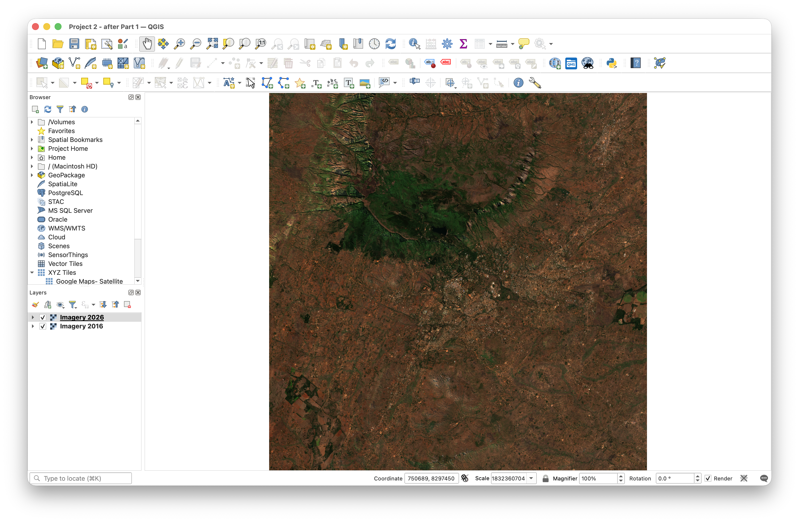
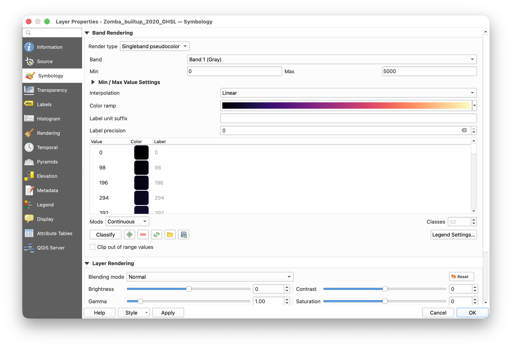
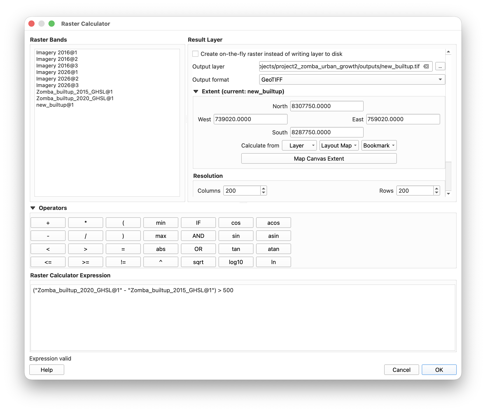

---
output:
  pdf_document:
    latex_engine: xelatex
mainfont: Lucida Grande
monofont: Menlo
monofontoptions:
  - HyphenChar=None
header-includes:
  - \AtBeginDocument{\raggedright}
fontsize: 11pt
geometry: margin=2cm
# Knit writes the PDF straight into training_2026/handouts/
knit: (function(input, ...) rmarkdown::render(input, output_dir = normalizePath(file.path(dirname(input), "..", "..", "handouts"))))
---

# Project 2 — Urban growth in Zomba

**What you'll make:** a map of where Zomba grew, and a table of how much built-up land each traditional authority gained.

**The question:** Zomba is growing. *Where* is it growing, and how much? A map of the town today can't answer that. You need the same place at two points in time.

**How:** you'll compare two satellite pictures ten years apart by eye, then measure the change properly using a ready-made built-up layer, because measuring growth from the pictures themselves turns out not to work here. Part 2 explains why.

Written for **QGIS 3.44**.

---

## What's in the folder

Open the folder `day3_projects/project2_zomba_urban_growth` on your flash drive. Copy it to your laptop first (for example to your Desktop) and work from the copy. Everything covers the same 20 × 20 km square around Zomba City.

| File | What it is |
|---|---|
| `Zomba_Sentinel2_RGB_20160730.tif` | Color picture, 30 July 2016. Pixels are 10 × 10 m |
| `Zomba_Sentinel2_RGB_20260720.tif` | Color picture, 20 July 2026 |
| `Zomba_Sentinel2_NIR_*.tif` | The near-infrared band for each date |
| `Zomba_Sentinel2_SWIR_*.tif` | The shortwave-infrared band for each date |
| `Zomba_builtup_2015_GHSL.tif` | Built-up surface in 2015: square meters of building in each 100 × 100 m cell |
| `Zomba_builtup_2020_GHSL.tif` | The same for 2020 |
| `zomba_buildings.shp` | 123,779 building outlines (Google Open Buildings) |
| `zomba_areas.gpkg` | Zomba City and the five traditional authorities |
| `mwi_pop_2025_CN_100m_R2025A_v1.tif` | Estimated people per 100 × 100 m square, 2025 (WorldPop). Only needed for Extension C |

| Folder | What it is |
|---|---|
| `checkpoints/` | Saved QGIS projects to fall back on if you get stuck |
| `outputs/` | Empty. Everything you make goes in here |

---

## Part 1 — Look at the two pictures

**1.1 Open QGIS** and start a new, empty project: **Project ▸ New**.

**1.2 Load both color pictures.** **Layer ▸ Add Layer ▸ Add Raster Layer…**, click **…** next to *Raster dataset(s)*, hold **Ctrl** and choose `Zomba_Sentinel2_RGB_20160730.tif` and `Zomba_Sentinel2_RGB_20260720.tif`. **Add**, **Close**.

**1.3 Put 2026 on top.** Drag it above 2016 in the **Layers** panel, then untick and tick it to flip between the two dates.



**You should now see** the town and the plateau to the north. Flipping between years, look for pale grey and white specks appearing on the edges of town: those are new roofs. The plateau and the fields change color between the years too, but that's the season, not growth.

**1.4 Save your project** in `outputs` as `project2.qgz`. Save again (**Ctrl+S**) at the end of every part.

**Checkpoint.** If the pictures won't load, open `project2_checkpoint_1.qgz` from the `checkpoints` folder.

---

## Part 2 — Why we don't measure growth from these pictures

It would seem natural to find the built-up areas in each picture and compare them. Here is why that fails at Zomba, and it is worth understanding before you trust any change map.

Both pictures are from **July, the dry season**. Rooftops are bright and reflect strongly in the shortwave-infrared band. So does **bare, dry soil**. A standard built-up index applied to these pictures marks **82% of this square as built-up in 2016 and 73% in 2026**, when the true figure is around 3%. The "change" you would get is mostly fields drying at different rates in two different years.

So we use the pictures for **looking**, and a purpose-built layer for **measuring**.

**2.1 Load the built-up layers.** Load `Zomba_builtup_2015_GHSL.tif` and `Zomba_builtup_2020_GHSL.tif` the same way as in 1.2.

Each cell holds **square meters of built-up surface in a 100 × 100 m cell**, so a value of 2,000 means a fifth of that cell is building.

**2.2 Style them.** Right-click `Zomba_builtup_2020_GHSL` ▸ **Properties… ▸ Symbology**:

- **Render type:** Singleband pseudocolor
- **Min:** `0`   **Max:** `5000` (type these in)
- **Color ramp:** Magma
- Click **Apply**, then **Transparency** (left side) ▸ **Additional no data value:** `0` ▸ **OK**

Give the 2015 layer the same style: right-click 2020 ▸ **Styles ▸ Copy Style**, right-click 2015 ▸ **Styles ▸ Paste Style**.



**You should now see** a heat map of the town: brighter white  in the center, orangeish purple along the roads, fading to black in the villages. **Both layers must use the same Min and Max**, or the two years aren't comparable.

**Checkpoint.** `project2_checkpoint_2.qgz` has both layers loaded and styled.

> **Where does this layer come from?** It is modelled by the European Commission from Landsat and Sentinel-2 images, for every fifth year. It is not a direct measurement of each building, and it is worth telling anyone you show the map. The same product offers 2025 and 2030, but those are **projections**, so this project stops at 2020.

---

## Part 3 — Find where it grew

**3.1 Subtract one year from the other.** **Raster ▸ Raster Calculator…**

- Build this expression (double-click the layer names in **Raster Bands** rather than typing them):

    ```
    ("Zomba_builtup_2020_GHSL@1" - "Zomba_builtup_2015_GHSL@1") > 500
    ```

- **Output layer:** click **…**, go to `outputs`, name it `new_builtup.tif`
- **Output format:** GeoTIFF. **Add result to project:** ticked. **OK**

This keeps cells that gained **more than 500 m² of building** between 2015 and 2020, which is roughly ten average houses in one cell. It is a judgment call; Extension A asks what happens if you choose differently.



**3.2 Hide the cells that didn't grow.** Right-click `new_builtup` ▸ **Properties… ▸ Symbology** ▸ **Render type: Paletted/Unique values** ▸ **Classify** ▸ select the row for **0** ▸ red **minus** button ▸ give **1** a strong red ▸ **OK**.

**You should now see** red cells in a ring around the town, and a scatter of them along the roads out of it. Very little red in the middle of town.

---

## Part 4 — Turn growth into shapes, and count the buildings in it

**4.1 Polygonize.** **Raster ▸ Conversion ▸ Polygonize (Raster to Vector)…**

- **Input layer:** `new_builtup`  ·  **Band:** 1  ·  **Field to create:** `DN`
- **Vectorized:** **…** ▸ **Save to File…** ▸ `outputs/growth_areas.gpkg` ▸ **Run**, then **Close**

**4.2 Keep only the growth shapes.** Right-click the new layer ▸ **Filter…**, enter:

```
"DN" = 1
```

Click **Test**.

**You should now see** **343** shapes. Click **OK** twice.

**4.3 Load the buildings** (`zomba_buildings.shp`) with **Layer ▸ Add Layer ▸ Add Vector Layer…**. There are **123,779** of them across the square.

**4.4 Which buildings stand in the growth areas?** **Processing ▸ Toolbox**, then **Vector general ▸ Join attributes by location**:

- **Join to features in:** `zomba_buildings`
- **Features they:** tick **intersect** only
- **By comparing to:** `growth_areas`
- **Discard records which could not be joined:** **ticked**
- **Joined layer:** `outputs/buildings_in_growth.gpkg` ▸ **Run**

**You should now see** **5,669** buildings.

> **Why 5,669 and not 5,668?** One building sits across the boundary of two growth shapes, so the default join lists it twice. If you need a count of *buildings* rather than a count of *matches*, set **Join type** to "Take attributes of the first matching feature only", which gives 5,668. Worth knowing before you report a number.

**Checkpoint.** `project2_checkpoint_3.qgz` has all of this done.

---

## Part 5 — The table: how much did each area gain?

**5.1 Load the boundaries:** `zomba_areas.gpkg` (Zomba City and five traditional authorities).

**5.2 Add up built-up surface per area, for each year.** **Processing ▸ Toolbox ▸ Raster analysis ▸ Zonal statistics**:

- **Input layer:** `Zomba_builtup_2015_GHSL`  ·  **Vector layer containing zones:** `zomba_areas`
- **Statistics to calculate:** tick **Sum** only  ·  **Output column prefix:** `b15_`
- **Output:** `outputs/zomba_growth_table.gpkg` ▸ **Run**

Run it again **on the result**, this time with `Zomba_builtup_2020_GHSL` and prefix `b20_`.

**5.3 Read the table.** Right-click the final layer ▸ **Open Attribute Table**. The numbers are in square meters; divide by 1,000,000 for km².

**You should now see** something close to this:

| Area | Built-up 2015 (km²) | Built-up 2020 (km²) | Growth (km²) | Growth (%) |
|---|---|---|---|---|
| Zomba City | 4.53 | 4.75 | 0.22 | +5% |
| TA Mlumbe | 1.71 | 1.97 | 0.26 | +15% |
| TA Malemia | 1.69 | 1.95 | 0.26 | +15% |
| TA Chikowi | 1.34 | 1.64 | 0.30 | +22% |
| TA Mwambo | 1.14 | 1.47 | 0.32 | +28% |
| TA Kuntumanji | 0.74 | 0.83 | 0.09 | +12% |

**This is the finding.** Zomba City has by far the most built-up land, and the **slowest** growth. The fastest growth is in the traditional authorities around it. The town is spreading outwards past its own boundary, which is exactly the pattern a city boundary drawn decades ago will hide.

**5.4 Make the map.** Turn on `Imagery 2026`, `new_builtup` and `zomba_areas`. **Project ▸ Import/Export ▸ Export Map to Image…**, save as `outputs/zomba_growth_map.png`.

---

## Part 6 — For your report-back

1. **What we asked:** where did Zomba grow between 2015 and 2020, and by how much?
2. **What we found:** the total (11.16 → 12.62 km², +13%), and which areas grew fastest. Show your map and your table.
3. **What this can't tell us:**
   - The built-up layer is **modelled**, not counted. It is good at "where", weaker at "exactly how much".
   - It measures **roofs, not people**. More building is not automatically more residents.
   - Our cut-off of 500 m² per cell decided what counted as growth (see Extension A).
   - The pictures are 2016 and 2026; the measurements are 2015 and 2020. They are not the same period.
4. **What we'd need to do it properly:** building permits, the census, or a field visit to a sample of the growth areas.

---

## Extensions

**A. Does the cut-off change the answer?** Repeat Parts 3 and 4 with `> 200` and then `> 1000` instead of `> 500`. How many growth cells each time? How much would your headline number move?

**B. Does the map match the pictures?** Zoom to a cluster of red cells and flip between `Imagery 2016` and `Imagery 2026`. Can you see the new roofs? Now find a place where the pictures show new roofs but no red cell appears. What would explain that?

**C. Growth per person.** Load `mwi_pop_2025_CN_100m_R2025A_v1.tif` and run Zonal statistics (Sum) on `zomba_areas`. Which area gained the most built-up land per resident?
