---
output:
  pdf_document:
    latex_engine: xelatex
mainfont: Lucida Grande
monofont: Menlo
monofontoptions:
  - HyphenChar=None
header-includes:
  - \AtBeginDocument{\raggedright}
fontsize: 11pt
geometry: margin=2cm
# Knit writes the PDF straight into training_2026/handouts/
knit: (function(input, ...) rmarkdown::render(input, output_dir = normalizePath(file.path(dirname(input), "..", "..", "handouts"))))
---

# Project 4 — Flooding in Chikwawa

**What you'll make:** a map of the March 2025 flood in part of Chikwawa District, and a list of the buildings that were touched by the water, saved as a spreadsheet.

**The question:** In March 2025 the Shire River flooded in Chikwawa as well as Nsanje. If aid is limited, *which households in this area should be reached first?*

**How:** exactly the steps from Day 1, on a new place. If Day 1 felt rushed, this is your second pass. Take it slowly and check each "You should now see" before moving on.

Written for **QGIS 3.44**.

------------------------------------------------------------------------

## What's in the folder

Open the folder `day3_projects/project4_chikwawa_flood` on your flash drive. Copy it to your laptop first (for example to your Desktop) and work from the copy.

| File | What it is |
|------------------------------------|------------------------------------|
| `Chikwawa_Landsat8_RGB_preflood.tif` | Color image, 19 September 2024 (dry season, before the flood) |
| `Chikwawa_Landsat8_RGB_postflood.tif` | Color image, 14 March 2025 (after the flood) |
| `Chikwawa_Landsat8_NIR_preflood.tif` | Near-infrared band, before the flood |
| `Chikwawa_Landsat8_NIR_postflood.tif` | Near-infrared band, after the flood |
| `chikwawa_buildings.shp` | 93,705 building outlines (Google Open Buildings) |

The images are 30 × 30 km along the Shire River, from the Landsat 8 satellite. Each pixel is 30 × 30 m.

The folder also has `checkpoints/` (saved QGIS projects to fall back on if you get stuck) and an empty `outputs/`. Everything you make goes in `outputs/`.

------------------------------------------------------------------------

## Part 1 — Start a project and look at the images

**1.1 Open QGIS** and start a new, empty project: **Project ▸ New**.

**1.2 Load the before and after color images.** **Layer ▸ Add Layer ▸ Add Raster Layer…**, click **…** next to *Raster dataset(s)*, choose `Chikwawa_Landsat8_RGB_preflood.tif`, then **Add**. Do the same for `Chikwawa_Landsat8_RGB_postflood.tif`, then **Close**.

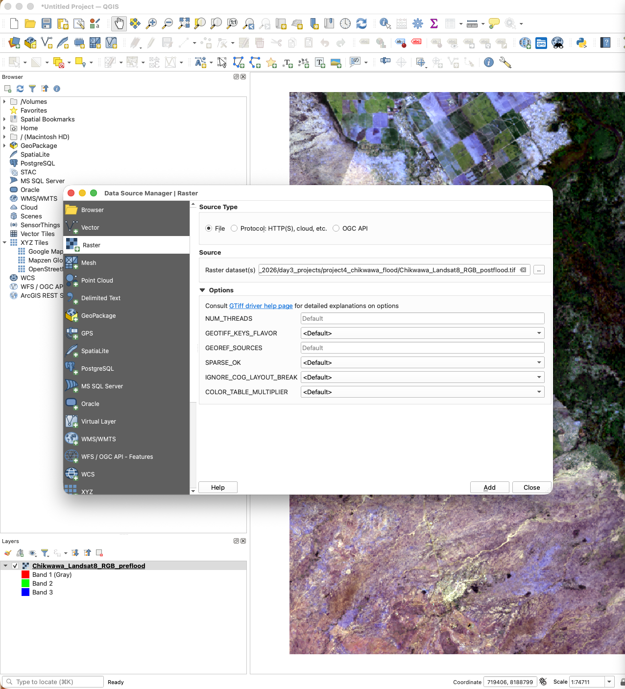

**You should now see** a vivid green landscape with the Shire River running through it, and two layers in the **Layers** panel on the left. If you uncheck the box next to `Chikwawa_Landsat8_RGB_postflood.tif`, you should see a more dull brown version of the same landscape.

**1.3 Compare before and after.** In the Layers panel, untick and tick the top layer to flip between the two dates. Zoom in on the river (scroll wheel). If you zoom too far, right click on one of the layers in the bottom left and select the first option, "Zoom to Layer(s)".

**You should now see** that the March image is greener, and that some areas near the river look darker. Can you tell which dark areas are water and which are wet soil? (It's hard — that's why we use the near-infrared band next.)

**1.4 Save your project.** **Project ▸ Save As…**, save it in `outputs` as `project_4_checkpoint_1.qgz`. Save again (**Ctrl+S**) at the end of every part. If you are having difficulty following to this point, you can load `project_4_checkpoint_1.qgz` from the `checkpoints` folder.

------------------------------------------------------------------------

## Part 2 — Find the water

Water absorbs near-infrared light, so water pixels have **low** near-infrared values. We'll look at the values, choose a cut-off, and keep only the pixels below it.

**2.1 Load both near-infrared images:** `Chikwawa_Landsat8_NIR_preflood.tif` and `Chikwawa_Landsat8_NIR_postflood.tif`, the same way as in 1.2. Uncheck the RGB layers.

**You should now see** two black-and-white images overlaid. You can uncheck each to compare them.

We'll do this for the **before-flood** image first, so you know what normal looks like, then repeat it for the after-flood image.

**2.2 Look at the histogram of the before-flood image.** Right-click `Chikwawa_Landsat8_NIR_preflood` ▸ **Properties…** ▸ **Histogram** (left side) ▸ **Compute Histogram**.

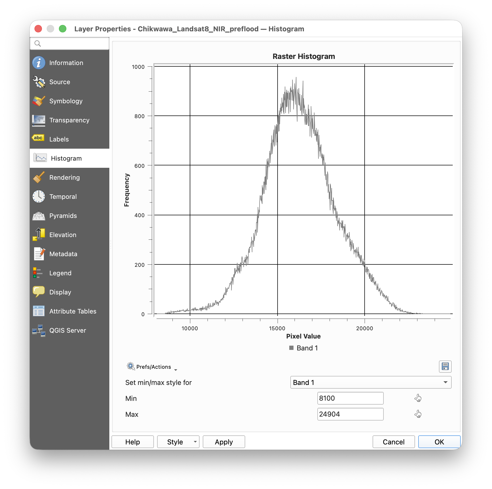

**You should now see** one big hump of land pixels, peaking at around 15,000–16,000, and a very thin tail of darker pixels on the far left, below about 10,000. September is the dry season, so there is very little water: mostly just the river.

On Day 1 we used 10,000 as the cut-off. We'll use it again. Close the Properties window.

**2.3 Make the before-flood water layer.** **Raster ▸ Raster Calculator…**

-   In **Raster Bands**, double-click `Chikwawa_Landsat8_NIR_preflood@1`. It appears in the expression box.

-   Type `< 10000` after it, so the expression reads:

    ```         
    "Chikwawa_Landsat8_NIR_preflood@1" < 10000
    ```

-   Make sure **Create on-the-fly raster instead of writing layer to disk** is **not** ticked.

-   **Output layer:** click **…**, go to `outputs`, name it `water_preflood.tif`.

-   **Output format:** GeoTIFF. **Add result to project:** ticked. Click **OK**.

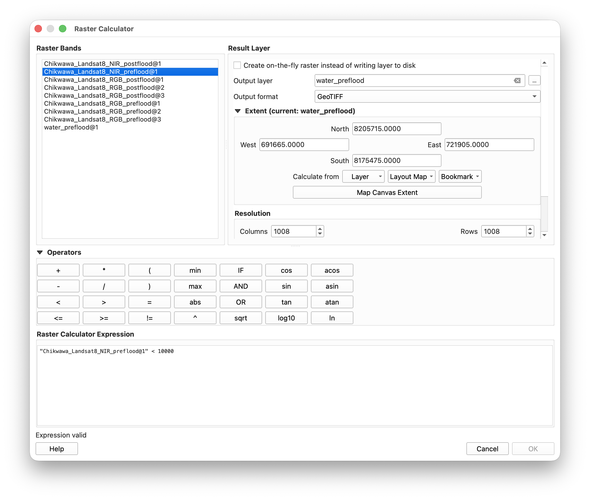

**You should now see** a new black-and-white layer, `water_preflood`. White pixels (value 1) are probably water; black pixels (value 0) are probably not. At the bottom of the Raster Calculator it should have said *"Expression is valid"* before you clicked OK.

**2.4 Hide the non-water pixels.** Right-click `water_preflood` ▸ **Properties…** ▸ **Symbology**. Change **Render type** to **Paletted/Unique values** and click **Classify**. Click the row with value **0**, then the red **minus** button. Choose a bright color for **1** by double-clicking its color box. Click **OK**.

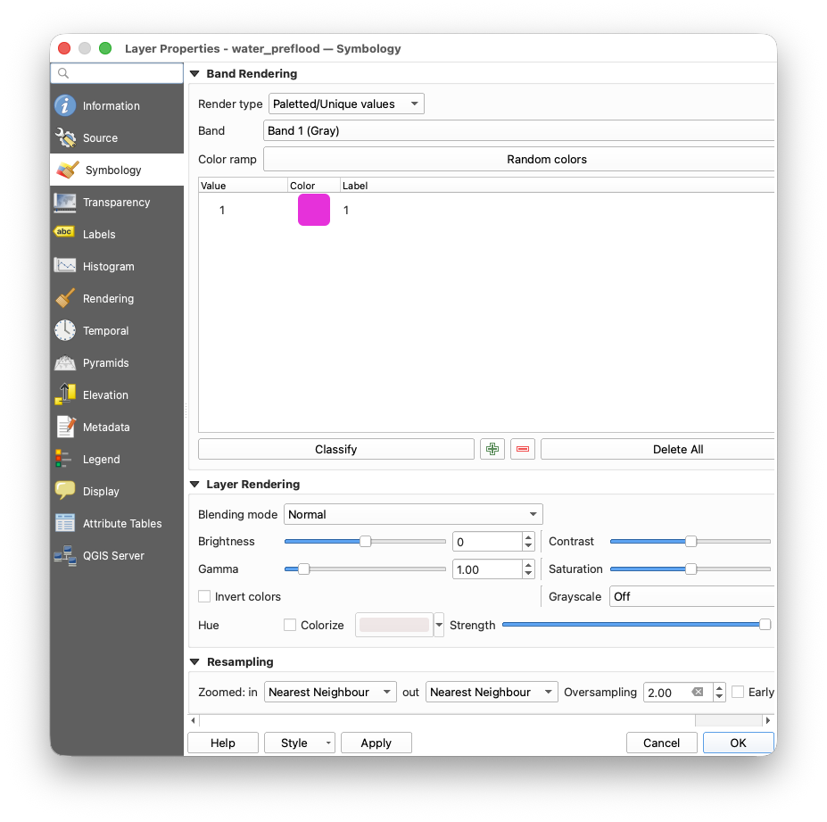

**You should now see** only the water pixels, in your color, on top of the other layers: a thin line along the river and a few small patches.

**2.5 Now look at the after-flood histogram.** Temporarily hide the water_preflood layer by unticking the box to the left in the layer pane. Right-click `Chikwawa_Landsat8_NIR_postflood` ▸ **Properties…** ▸ **Histogram** ▸ **Compute Histogram**.

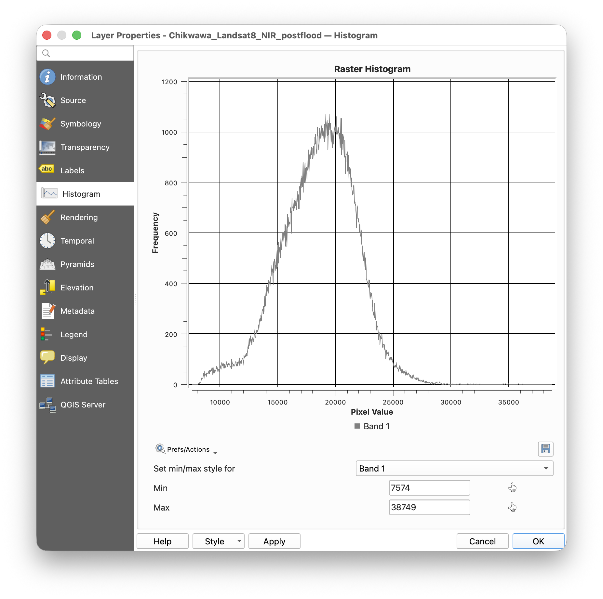

**You should now see** two differences from September. The big land hump has moved to the right, peaking at around 19,000, because plants are greener in the rainy season and reflect more near-infrared. And the group of dark pixels below 10,000 is bigger. That bigger group is the flood.

**2.6 Make the after-flood water layer.** Repeat 2.3 and 2.4 with `Chikwawa_Landsat8_NIR_postflood@1`, so the expression reads:

```         
"Chikwawa_Landsat8_NIR_postflood@1" < 10000
```

Save it to `outputs/water_postflood.tif`, and give it a different color from the before-flood water.

**You should now see** a second water layer, `water_postflood`, following the river and spreading into the marsh.

**2.7 Compare.** Drag `water_preflood` above `water_postflood` in the Layers panel. If it's easier, you can right click `water_postflood` and click "Move to Bottom", or right click `water_preflood` and click "Move to Top".

**You should now see** that the September water (the river channel, mostly) is much smaller than the March water. Roughly **three times as much** of the area is water in March.

Save your project as `project_4_checkpoint_2.qgz` in the `outputs` folder. If your project doesn't look like the screenshot below, with different colors for the pre and post flood layers, you can load the checkpoint from `project_4_checkpoint_2.qgz` in the `checkpoints` folder.

------------------------------------------------------------------------

## Part 3 — Turn the water into shapes

Buildings are shapes (vectors). To compare them with the water, we turn the water pixels into shapes too.

**3.1 Polygonize.** **Raster ▸ Conversion ▸ Polygonize (Raster to Vector)…**

> **Can't find Raster ▸ Conversion?** If the **Raster** menu only shows
> **Raster Calculator**, the Processing plugin is switched off:
>
> 1.  **Plugins ▸ Manage and Install Plugins… ▸ Installed**, tick
>     **Processing**, and close the window. Check the **Raster** menu
>     again.
> 2.  Still missing? **Settings ▸ Options… ▸ Processing ▸ Providers ▸
>     GDAL**, tick **Activate**, click **OK**, and restart QGIS.
>
> You can also open the same tool without the menu: **Processing ▸
> Toolbox**, search for `polygonize`, and double-click **Polygonize
> (raster to vector)** under **GDAL ▸ Raster conversion**. Part 4 uses
> the Toolbox too, so fix this now.

-   **Input layer:** `water_postflood`
-   **Band number:** Band 1
-   **Name of the field to create:** `DN`
-   **Use 8-connectedness:** leave unticked
-   **Vectorized:** click **…** ▸ **Save to File…**, go to `outputs`, name it `water_postflood_shapes.geojson`
-   Click **Run**, wait for it to finish, then **Close**.

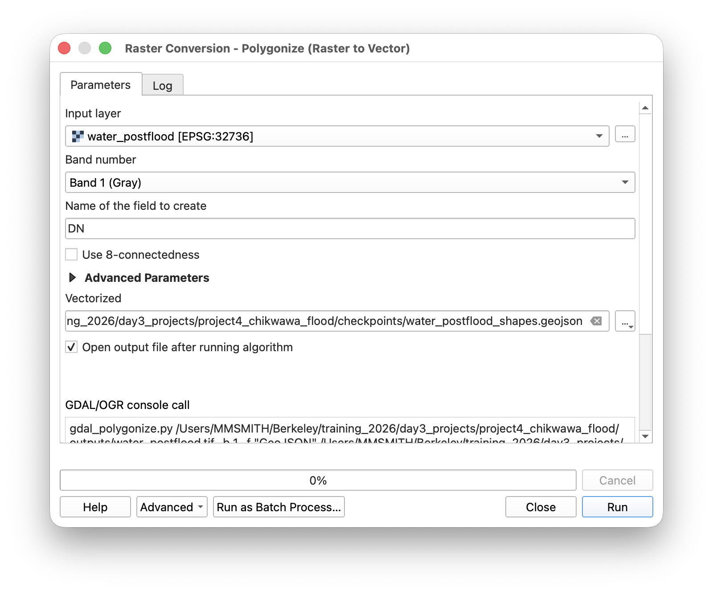

**You should now see** a new layer, `water_postflood_shapes`, covering the whole image with shapes. Right-click it ▸ **Show Feature Count**: it should say **1,666**.

**3.2 Keep only the water shapes.** Every shape has a `DN` value: 1 for water, 0 for not-water. Right-click `water_postflood_shapes` ▸ **Filter…**. In the box at the bottom, type:

```         
"DN" = 1
```

Click **Test**.

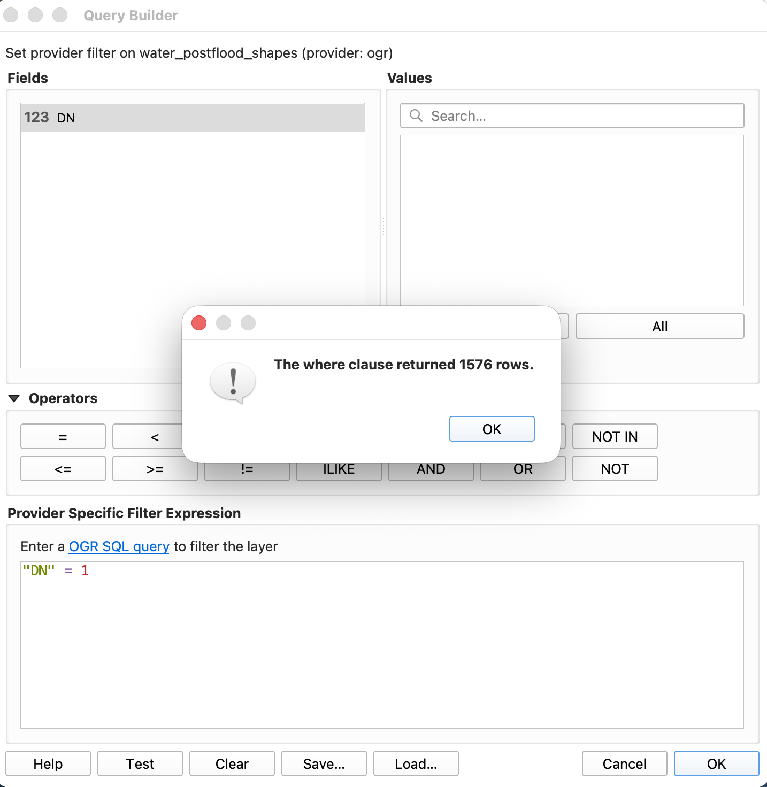

**You should now see** a message saying the filter returned **1,576** rows. Click **OK**, then **OK** again. The feature count next to the layer name should now show **1,576**.

> **Error message?** Check you typed a single `=`, and that `DN` is in
> straight double quotes.

Save your project as `project_4_checkpoint_3.qgz` in the `outputs` folder. If you have had difficulty getting to this point, you can load the current state from `project_4_checkpoint_3.qgz` from the `checkpoints` folder.


------------------------------------------------------------------------

## Part 4 — Which buildings were touched by the flood?

**4.1 Load the buildings.** **Layer ▸ Add Layer ▸ Add Vector Layer…**, click **…**, choose `chikwawa_buildings.shp`, **Open**, **Add**, **Close**.

**You should now see** thousands of tiny shapes, clustered into villages. Show Feature Count should say **93,705**. Zoom in to see individual buildings.

**4.2 Join buildings to the water.** **Processing ▸ Toolbox**. In the Toolbox panel, open **Vector general** and double-click **Join attributes by location**.

-   **Join to features in:** `chikwawa_buildings`
-   **Features they (geometric predicate):** tick **intersect** only
-   **By comparing to:** `water_postflood_shapes`
-   **Fields to add:** leave empty
-   **Join type:** leave the default
-   **Discard records which could not be joined:** **ticked** — this is the important one
-   **Joined layer:** click **…** ▸ **Save to File…**, `outputs/flooded_buildings.geojson`
-   Click **Run**, then **Close**.

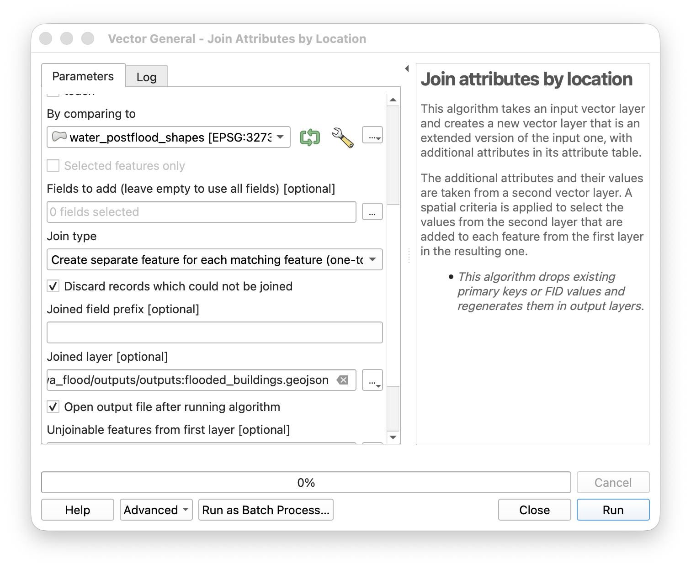

**You should now see** a new layer, `flooded_buildings`. Show Feature Count should say **55**. These are the buildings that touch the March 2025 water.

> **Got 93,705 instead of 55?** "Discard records which could not be
> joined" wasn't ticked. Delete the layer and run 4.2 again.

**4.3 Look at them.** Right-click `flooded_buildings` ▸ **Zoom to Layer**, then zoom in to the upper middle of the screen.

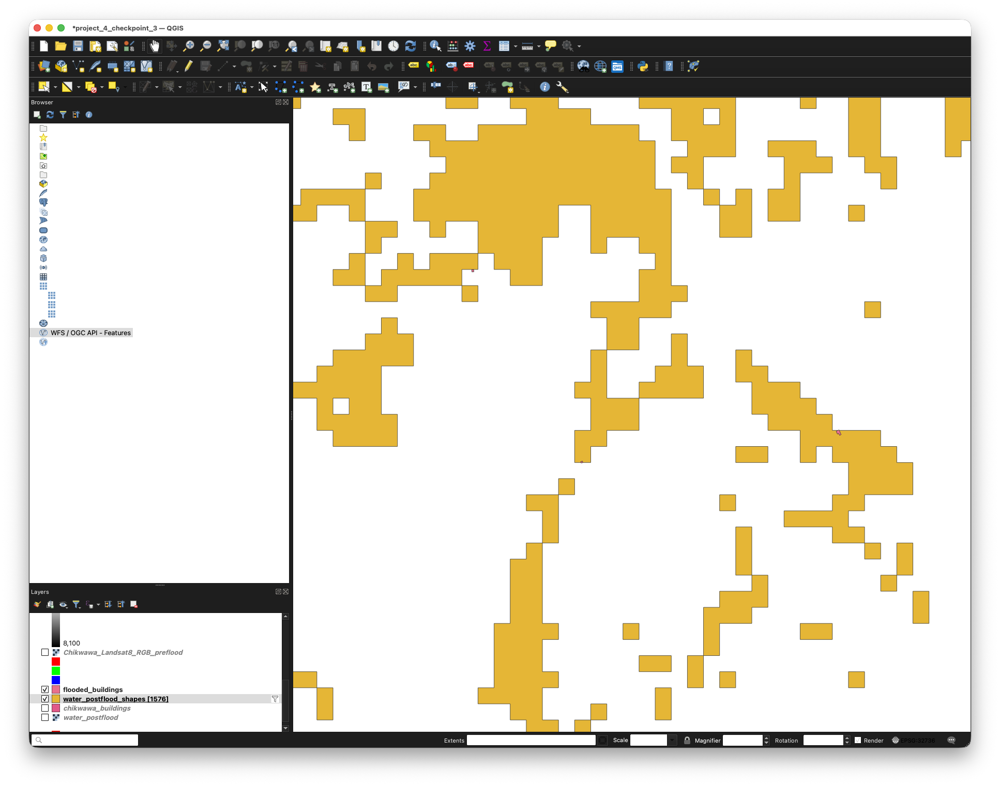

**You should now see** small clusters of buildings along the edges of the flood water. A typical building here is about 13 square meters, roughly 4 m across, so at a whole-district zoom it is smaller than one screen pixel and effectively invisible.

**4.4 Draw each building as a dot, so you can see them.** Right-click `flooded_buildings` ▸ **Properties…** ▸ **Symbology**.

-   At the top, click **Simple fill** in the list of symbol layers.
-   Change **Symbol layer type** to **Centroid fill**.
-   Under **Marker**, click **Simple marker**, set **Size** to `3` millimeters, and pick a strong color.
-   Click **OK**.

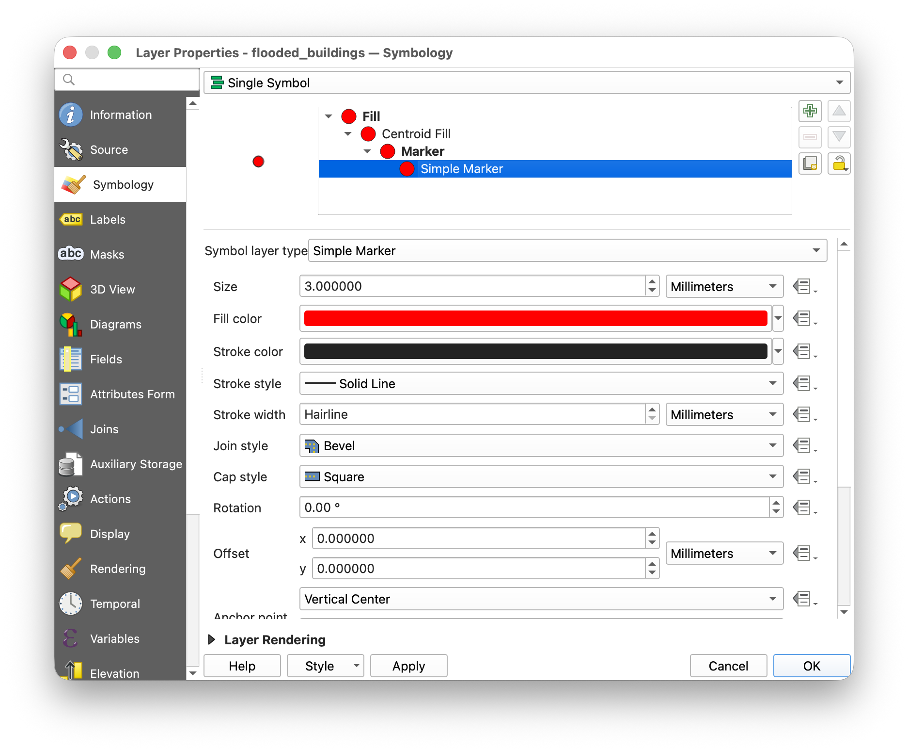

**You should now see** one dot for each flooded building, all 55 of them, and they stay the same size however far you zoom out. The dot marks the building's center, so it is a marker, not the building's real size or shape.

**4.5 Save the list.** Right-click `flooded_buildings` ▸ **Export ▸ Save Features As…**

-   **Format:** Comma Separated Value [CSV]
-   **File name:** `outputs/chikwawa_flooded_buildings.csv`
-   Click **OK**.

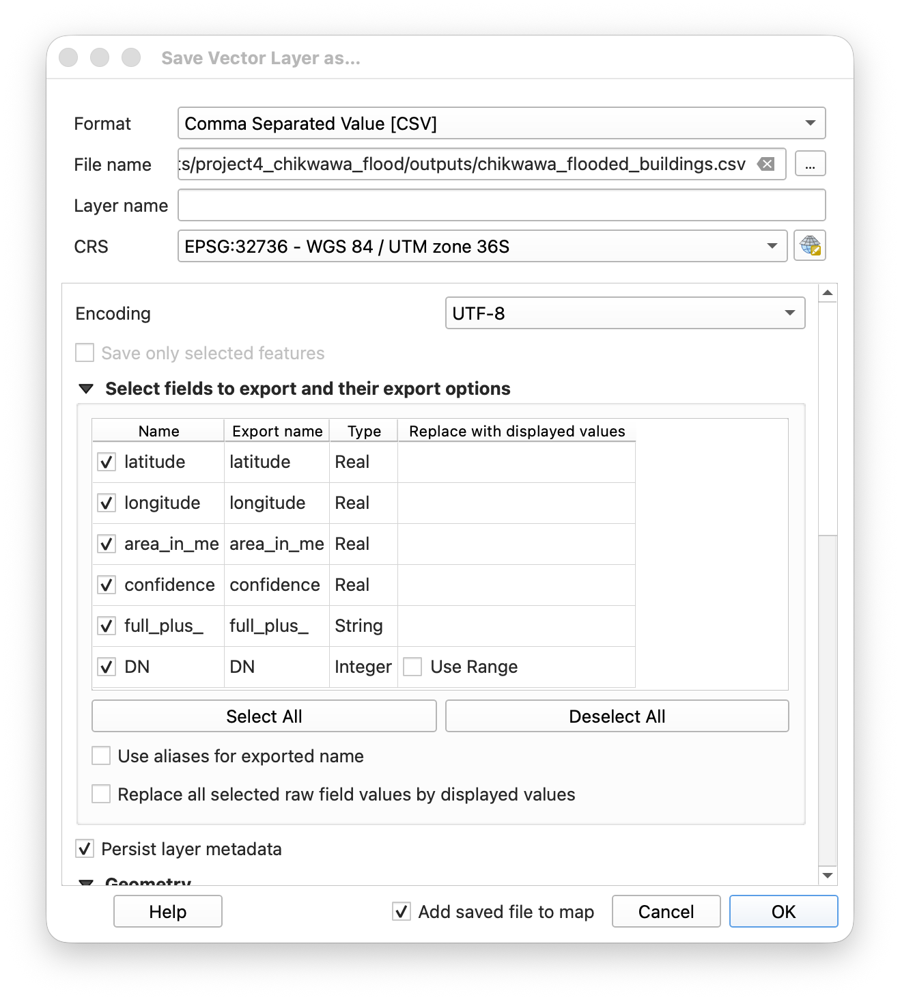

**You should now see** a new CSV file in `outputs`. Open it in Excel: 55 rows, one per building, with `latitude`, `longitude` and `area_in_me` (floor area in square meters).

Save your project as `project_4_checkpoint_4.qgz` in the `outputs` folder. If your join didn't work, or you want the dots already set up for the map below, load `project_4_checkpoint_4.qgz` from the `checkpoints` folder.

------------------------------------------------------------------------

## Part 5 — Make a map (optional)

Turn on: `flooded_buildings`, `water_postflood_shapes`, and `Chikwawa_Landsat8_RGB_postflood`, in order from top to bottom. Turn the rest off. Zoom to the part you want to show; with the dots from 4.4 the buildings stay visible even with the whole square on screen.

**Project ▸ Import/Export ▸ Export Map to Image…**, save as `outputs/chikwawa_flood_map.png`.

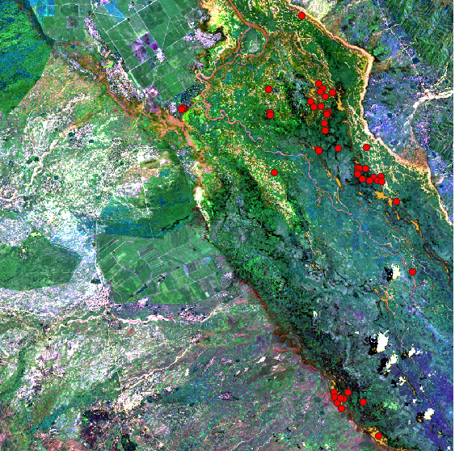

------------------------------------------------------------------------

## Part 6 — For your report-back

Be ready to say, in a few minutes:

1.  **What we asked:** which buildings in this part of Chikwawa were touched by the March 2025 flood?
2.  **What we found:** how many, and where they are.
3.  **What this can't tell us.** Some things to think about:
    -   The image is from **one day**, 14 March 2025. Was that the worst day of the flood? How could we know, or find out?
    -   A building **touching** a 30 × 30 m water pixel isn't necessarily **flooded inside**.
    -   The March image had a little cloud. What happens to water hidden under cloud?
    -   Some buildings were next to water **before** the flood too (see Extension B).
4.  **What we'd need to do it properly:** for example, a field check of a sample of these buildings.

------------------------------------------------------------------------

## Extensions (if you finish early)

**A. How much does the cut-off matter?** Repeat Parts 2–4 for the after-flood image with `< 9000` and then `< 11000` instead of `< 10000`. Write down the number of flooded buildings each time. How sure are you about the number you report?

**B. Water before the flood.** Repeat Parts 3–4 using `water_preflood` instead of `water_postflood`. How many buildings touched water in **September**, before any flood? What does that mean for your answer from Part 4?

**C. Compare with Nsanje.** Nsanje, on Day 1, is the same flood further downstream. How do the two areas differ?
